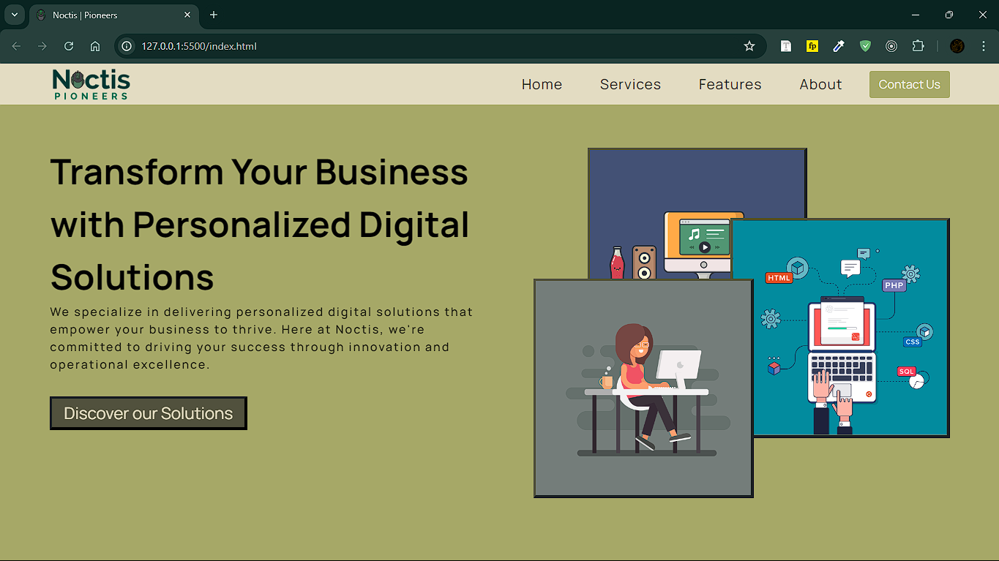
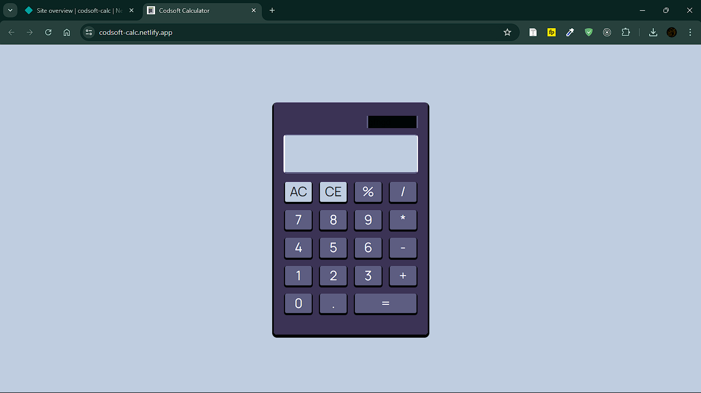
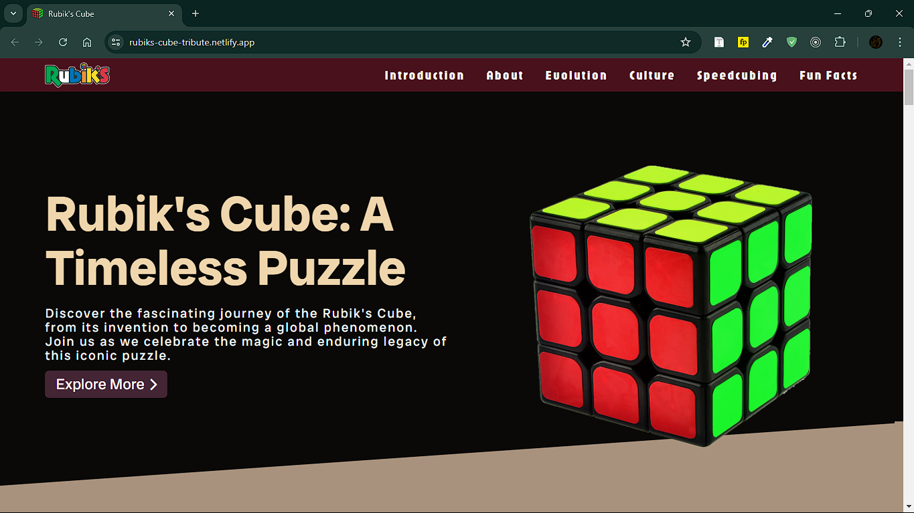

# Codsoft Internship Projects Repository

this repository will contain future links and screenshots of several projects upon completion.

## Level 1 Task 1: Landing Page

A tech services static landing page called Noctis | Pioneers. In this project, I was able tp practice HTML, CSS, and JavaScript. This was a fun experience  thinking about css properties/selectors that I forgot and using the classic @media again without the use of css frameworks for rwd and html/css tricks.
Live Link: https://noctis-pioneers.netlify.app/

### Coding Langauge used and best practices applied

- HTML5
- CSS3
- Vanila JavaScript
- CSS Grid/Flex box
- Responsive Web Design
- Mobile-first
- UI/UX Design

## Level 1 Task 3: Calculator

a simple calculator built with HTML, CSS, and a bit of Javascript. Designed to resemble an actual calculator. In terms of logic, it is only capable of doing one calculation using eval(), if more than one, the operator precedence wins instead of calculating form left-to-right. It was a fun experience especially the designing part.
Link Link: https://codsoft-calc.netlify.app/

## Level 2 Task 1: Tribute Page

A Tribute Page for the Rubik's Cube Puzzle. Made completely from scratch using HTML, CSS, and a bit of Javascript. As for why I chose Rubik's Cube for making a tribute page. It is because of my connection with this puzzle as a former 2-time speedcubing champion, with it also being one of the things that really helped me socialize and make friends as an introvert. It was a fun experience and will definitely add more to it soon like learning resources, world record holders, variants aside from 3x3 and so on and so forth. If you're interested on visiting this site, here is the live link: https://rubiks-cube-tribute.netlify.app/

## Level 1 Task 2: Portfolio

A Website Portfolio made with React.js and packages like react-anchor-link-smmooth-scroll. It is a brand new portfolio that was started from its own repository since I want to use it as well. It was a fun experience especially the part of choosing a theme and color palette before the catual coding, added some effects and minimal animation, also added a ffunctional contact section for potential discussions in the near future.